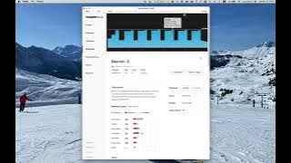

# tr2zwo

A python package to convert TrainerRoad workouts into Zwift ZWO format custom
workout files. This allows TrainerRoad subscribers to easily follow their
TrainerRoad plan in the Zwift world.

You must have your FTP in Zwift set to the same value in TrainerRoad for the
workout to be accurate because the intervals are all set as a percentage of
your ftp. Currently you can set this in the application from the home screen
menu under "My Profile". The menu is under the image of your face (if you've
set it) on the top right next the exit button.

## installation

```shell
$ python -m pip install tr2zwo
```

## Usage

```shell
$ tr2zwift -h
usage: tr2zwift [-h] [--verbose] {setup,fetch} ...

Convert a TrainerRoad workout to a Zwift .zwo file

positional arguments:
  {setup,fetch}
    setup        initial setup, can be run again to update settings
    fetch        fetch a workout

options:
  -h, --help     show this help message and exit
  --verbose, -v  provide feedback while running
```

```shell
 $ tr2zwift setup -h
 usage: tr2zwift setup [-h] [--username USERNAME] [--password PASSWORD] [--directory DIRECTORY]

 options:
   -h, --help            show this help message and exit
   --username USERNAME, -u USERNAME
                         Your TrainerRoad username
   --password PASSWORD, -p PASSWORD
                         Your TrainerRoad password
   --directory DIRECTORY, -d DIRECTORY
                         Output directory for .zwo file s
```

```shell
$ tr2zwift fetch -h
usage: tr2zwift fetch [-h] [--print] url [url ...]

positional arguments:
  url          The URL(s) of the trainerroad workout(s) to fetch

options:
  -h, --help   show this help message and exit
  --print, -p  Print the zwo to stdout, does not write file

```

## Example

[](https://youtu.be/ve2a-b_3yZ4)

## References

[ZWO Tag Reference](https://github.com/h4l/zwift-workout-file-reference/blob/master/zwift_workout_file_tag_reference.md)
